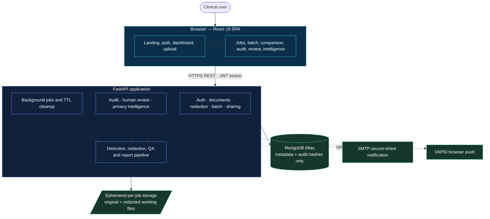
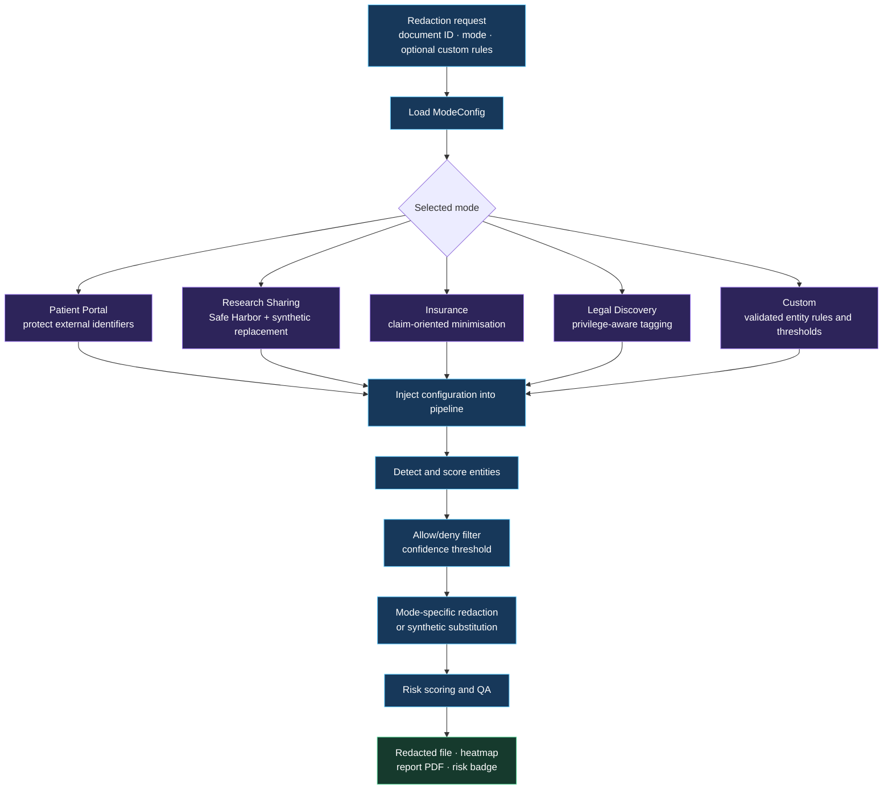
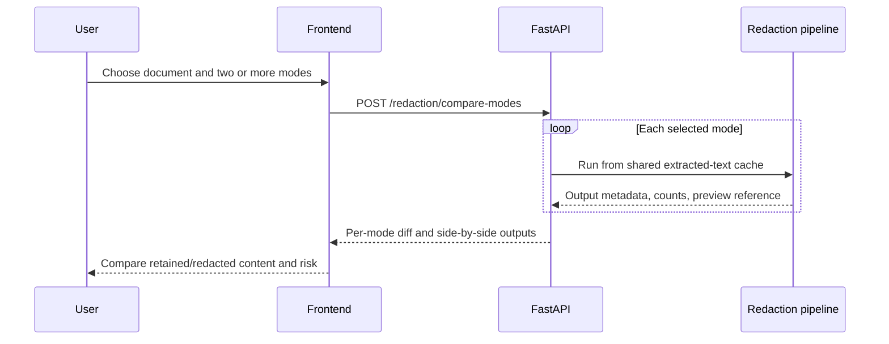
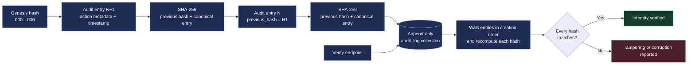
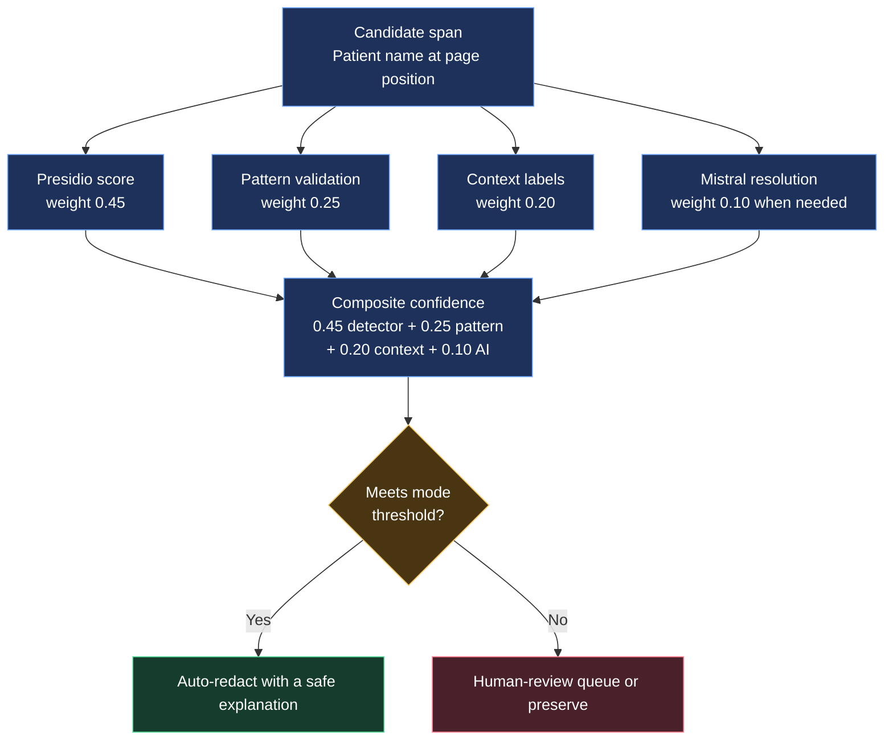

# MedVault — System Architecture

> High-level architecture reference for the MedVault Healthcare Document Privacy Pipeline.

---

## Overview

MedVault is designed around three non-negotiable principles:

1. **No PHI at rest** — Raw document files exist only in isolated temporary directories during active processing. MongoDB stores metadata, entity types, locations, confidence scores, and audit hashes — never the text content of PHI.
2. **Destructive redaction** — Redacted content is physically removed: PDF redactions are applied with PyMuPDF, images use pixel overwrite, and Office files use run/cell-level replacement. There is no recoverable overlay.
3. **Self-verifying outputs** — Each redacted file is re-scanned before export. A failed QA result blocks download until it is resolved.

---

## System Boundary Diagram



### Processing pipeline

```mermaid
flowchart LR
    Input[Uploaded document] --> Extract[Format-aware extraction\nPDF · Office · images · DICOM · email]
    Extract --> Chunks[Chunk text with overlap\nand retain page coordinates]
    Chunks --> P[Presidio PII]
    Chunks --> S[scispaCy medical NER]
    Chunks --> R[Healthcare regex\nMRN · NPI · DEA · policy]
    Chunks --> C[Context boost\nlabels and headers]
    P & S & R & C --> Merge[Merge, deduplicate and cache\nentities across the document]
    Merge --> Score[Composite confidence score]
    Score --> Gate{Ambiguous\n0.40–0.75?}
    Gate -->|Yes| AI[Mistral resolver\nminimal context only]
    Gate -->|No| Filter
    AI --> Filter[Privacy-mode rule filter]
    Filter --> Redact[Format-aware destructive redaction]
    Redact --> QA[Re-OCR and re-scan QA]
    QA -->|Pass| Deliver[Output, heatmap, report\nand audit entry]
    QA -->|Fail| Block[QA failed — export blocked]

    classDef source fill:#123e54,stroke:#49dbd3,color:#fff;
    classDef detector fill:#252052,stroke:#a581ff,color:#fff;
    classDef gate fill:#4b3210,stroke:#ffc65a,color:#fff;
    classDef output fill:#153a2e,stroke:#55d794,color:#fff;
    class Input,Extract,Chunks source;
    class P,S,R,C,Merge,Score,AI detector;
    class Gate,Filter,QA gate;
    class Redact,Deliver,Block output;
```



---

## Privacy Mode Architecture

Privacy modes are pure Python dataclasses in `backend/app/redaction/mode_configs.py`. Adding a mode changes configuration, not pipeline logic.



### Mode comparison feature



---

## Audit Trail Architecture

The audit trail is append-only, hash-chained, and verifiable without blockchain infrastructure.



---

## Confidence Scoring Architecture



---

## Data Flow — Single Document

```mermaid
sequenceDiagram
    autonumber
    participant U as User browser
    participant A as FastAPI
    participant T as Ephemeral storage
    participant P as Processing pipeline
    participant M as MongoDB metadata
    U->>A: Upload file
    A->>T: Create isolated per-job directory
    A-->>U: Return document ID
    U->>A: Start redaction with selected mode
    A-->>U: Return job ID
    A->>P: Queue processing
    P->>T: Extract content and create working output
    P->>P: Detect, score, resolve and redact
    P->>P: Re-OCR and re-scan QA
    P->>T: Write redacted artifact, heatmap and report
    P->>M: Save safe metadata and hash-chain audit entry
    loop While processing
        U->>A: Poll job status
        A-->>U: Queued or processing
    end
    U->>A: Read completed job
    A-->>U: Preview metadata and completed status
    U->>A: Download verified output
    A->>T: Read output; retain for active session/TTL
    A-->>U: Original file type with correct content disposition
```

---

## Deployment Architecture

```mermaid
flowchart LR
    User([User]) --> CDN
    subgraph Vercel[Vercel]
        CDN[React static application\nCDN delivery]
    end
    CDN -->|HTTPS REST| Render
    subgraph Render[Render web service]
        API[FastAPI + Uvicorn\nPython 3.12]
        Sys[Tesseract · Poppler\nzbar · OpenCV system tools]
        Temp[/tmp/medvault_jobs\nephemeral working storage]
        API --- Sys
        API --> Temp
    end
    API --> Atlas[(MongoDB Atlas\nmetadata only)]
    API -. optional .-> SMTP[Brevo / Gmail SMTP]
    API -. optional .-> Push[VAPID web push]

    classDef cloud fill:#18385a,stroke:#65b7ff,color:#fff;
    classDef compute fill:#2b2456,stroke:#b195ff,color:#fff;
    classDef storage fill:#163c2d,stroke:#59d997,color:#fff;
    class CDN,Vercel cloud;
    class API,Sys,Render compute;
    class Temp,Atlas,SMTP,Push storage;
```

**Render configuration**

| Setting | Value |
|---|---|
| Root directory | `backend` |
| Build command | `pip install -r requirements.txt` |
| Start command | `uvicorn app.main:app --host 0.0.0.0 --port $PORT` |
| Required system packages | `tesseract-ocr`, `poppler-utils`, `libgl1`, `libzbar0` |
| Temporary job directory | `/tmp/medvault_jobs` |
| Web concurrency | 1–2 workers for CPU-heavy OCR/CV workloads |

---

## Security Architecture

| Concern | Mitigation |
|---------|-----------|
| **PHI at rest** | Files deleted within 1-hour TTL; only metadata persists in MongoDB |
| **Raw PHI in database** | `redaction_entities` stores entity TYPE + LOCATION + EXPLANATION, never the PHI value |
| **Audit tampering** | SHA-256 hash chain; append-only collection; no update/delete routes exposed |
| **Redaction bypass** | QA loop re-OCRs and re-scans output; blocks download on failure |
| **Overlay attack** | PyMuPDF `apply_redactions()` is destructive — no text layer survives under visual boxes |
| **AI data leakage** | Mistral receives only a minimal context window, never full documents |
| **Share link abuse** | Password protection, per-link expiry, per-link download caps, revocation |
| **Authentication** | JWT with Argon2-hashed passwords; no SMS/phone number collected |
| **CORS** | Explicit origin allowlist; credentials blocked for wildcard origins |
| **Upload safety** | File size limit, file type validation, and per-job isolation |

---

## Technology Rationale Summary

| Choice | Alternative Considered | Why This Was Chosen |
|--------|----------------------|---------------------|
| **Microsoft Presidio** | Hand-rolled spaCy regex | Purpose-built PII framework; higher out-of-box accuracy; MIT licensed; pluggable |
| **scispaCy** | Generic spaCy | Trained on biomedical text; catches clinical entities that generic NER misses |
| **MongoDB** | PostgreSQL | Document-oriented fits variable-length entity arrays; no migration overhead for schema evolution |
| **Destructive PyMuPDF redaction** | Black-box overlay | Prevents copy-paste recovery of redacted content |
| **Process-and-discard storage** | Object storage | Zero PHI at rest and no persistent file storage cost |
| **Mistral AI** | Generic LLM fallback | Supports ambiguity resolution with constrained context |
| **VAPID Web Push** | SMS | Browser-native and avoids phone-number collection |
| **Beanie ODM** | Raw pymongo | Pydantic-native validation integrated with FastAPI schemas |
| **BackgroundTasks** | Celery + Redis | No additional infrastructure on the starter deployment tier |
