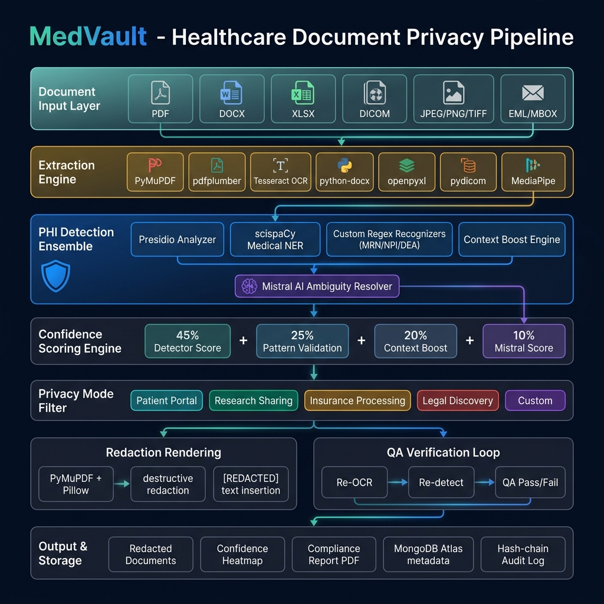
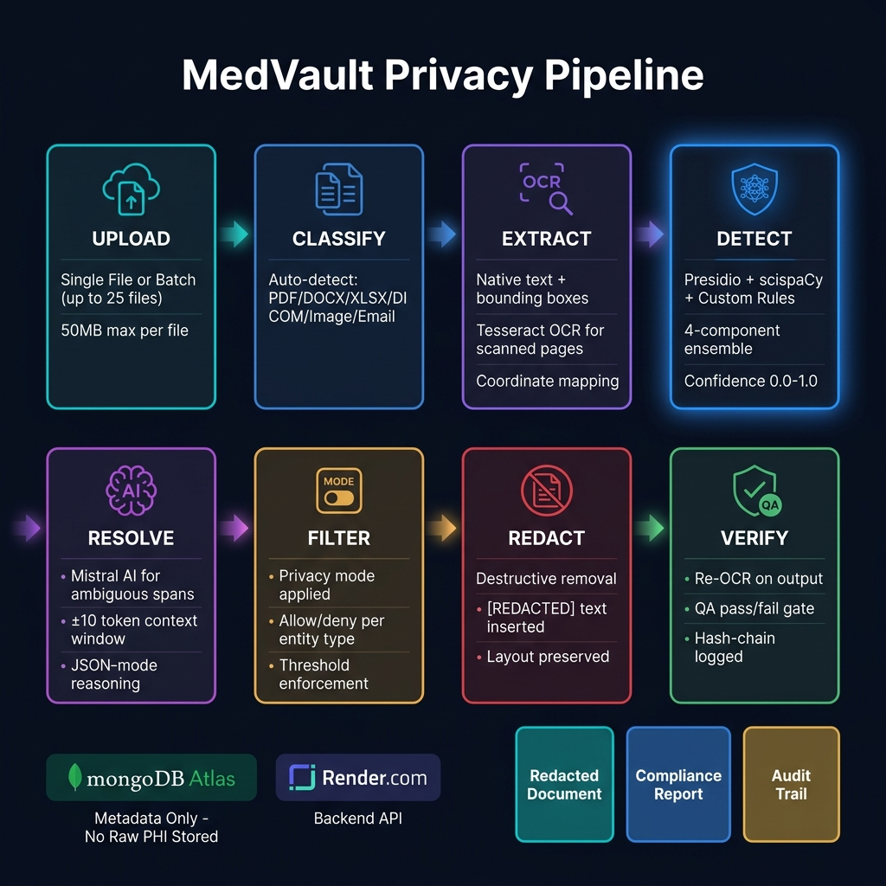

<div align="center">

<!-- Animated Title SVG -->
<svg xmlns="http://www.w3.org/2000/svg" viewBox="0 0 900 160" width="900" height="160">
  <defs>
    <linearGradient id="titleGrad" x1="0%" y1="0%" x2="100%" y2="0%">
      <stop offset="0%" style="stop-color:#00D2D3">
        <animate attributeName="stop-color" values="#00D2D3;#2C73D2;#7B2FBE;#00D2D3" dur="4s" repeatCount="indefinite"/>
      </stop>
      <stop offset="50%" style="stop-color:#2C73D2">
        <animate attributeName="stop-color" values="#2C73D2;#7B2FBE;#00D2D3;#2C73D2" dur="4s" repeatCount="indefinite"/>
      </stop>
      <stop offset="100%" style="stop-color:#7B2FBE">
        <animate attributeName="stop-color" values="#7B2FBE;#00D2D3;#2C73D2;#7B2FBE" dur="4s" repeatCount="indefinite"/>
      </stop>
    </linearGradient>
    <filter id="glow">
      <feGaussianBlur stdDeviation="3" result="coloredBlur"/>
      <feMerge><feMergeNode in="coloredBlur"/><feMergeNode in="SourceGraphic"/></feMerge>
    </filter>
    <linearGradient id="bgGrad" x1="0%" y1="0%" x2="100%" y2="100%">
      <stop offset="0%" style="stop-color:#0A0F1E"/>
      <stop offset="100%" style="stop-color:#0D1635"/>
    </linearGradient>
  </defs>
  <rect width="900" height="160" rx="16" fill="url(#bgGrad)"/>
  <rect width="900" height="160" rx="16" fill="none" stroke="url(#titleGrad)" stroke-width="1.5">
    <animate attributeName="opacity" values="0.4;0.9;0.4" dur="3s" repeatCount="indefinite"/>
  </rect>
  <g transform="translate(50,25)">
    <path d="M45 5 L85 20 L85 60 C85 82 65 95 45 100 C25 95 5 82 5 60 L5 20 Z" fill="none" stroke="url(#titleGrad)" stroke-width="2.5" filter="url(#glow)"/>
    <path d="M30 52 L42 64 L62 44" fill="none" stroke="#00D2D3" stroke-width="3" stroke-linecap="round" stroke-linejoin="round" filter="url(#glow)"/>
  </g>
  <text x="160" y="78" font-family="'Segoe UI',Arial,sans-serif" font-size="58" font-weight="700" fill="url(#titleGrad)" filter="url(#glow)" letter-spacing="-1">MedVault</text>
  <text x="162" y="110" font-family="'Segoe UI',Arial,sans-serif" font-size="16" fill="#8892A4" letter-spacing="3">HEALTHCARE DOCUMENT PRIVACY PIPELINE</text>
  <rect x="162" y="124" width="60" height="22" rx="11" fill="#00D2D3" opacity="0.15"/>
  <text x="192" y="139" font-family="'Segoe UI',Arial,sans-serif" font-size="12" fill="#00D2D3" text-anchor="middle" font-weight="600">v2.0.0</text>
  <circle cx="820" cy="80" r="4" fill="#00D2D3">
    <animate attributeName="r" values="4;7;4" dur="2s" repeatCount="indefinite"/>
  </circle>
  <circle cx="845" cy="80" r="4" fill="#2C73D2">
    <animate attributeName="r" values="4;7;4" dur="2s" begin="0.5s" repeatCount="indefinite"/>
  </circle>
  <circle cx="870" cy="80" r="4" fill="#7B2FBE">
    <animate attributeName="r" values="4;7;4" dur="2s" begin="1s" repeatCount="indefinite"/>
  </circle>
</svg>

<br/>

<p>
  
  
  
  
  
</p>
<p>
  
  
  
  
</p>

<svg xmlns="http://www.w3.org/2000/svg" width="700" height="4">
  <defs>
    <linearGradient id="scanGrad" x1="0%" y1="0%" x2="100%" y2="0%">
      <stop offset="0%" style="stop-color:transparent"/>
      <stop offset="30%" style="stop-color:#00D2D3"/>
      <stop offset="70%" style="stop-color:#2C73D2"/>
      <stop offset="100%" style="stop-color:transparent"/>
    </linearGradient>
  </defs>
  <rect width="700" height="4" rx="2" fill="url(#scanGrad)">
    <animate attributeName="opacity" values="0.3;1;0.3" dur="2s" repeatCount="indefinite"/>
  </rect>
</svg>

</div>

---

## Table of Contents

| Section | Section |
|---------|---------|
| [Problem Statement](#-problem-statement) | [Repository Guide](#-repository-guide) |
| [Solution Overview](#-solution-overview) | [Technology Stack](#-technology-stack) |
| [Feature Set](#-feature-set) | [Database Design](#-database-design) |
| [Architecture](#-architecture) | [Quick Start](#-quick-start) |
| [Processing Pipeline](#-processing-pipeline) | [Impact and Benefits](#-impact--benefits) |
| [Privacy Modes](#-privacy-modes) | [API Reference](#-api-reference) |
| [PHI Detection Engine](#-phi-detection-engine) | [License](#-license) |
| [AI Intelligence](#-ai-powered-intelligence) | |

---

## Problem Statement

Healthcare organizations face an impossible tension: the **duty to share** medical information (research, insurance claims, legal proceedings, patient access) and the **duty to protect** it (HIPAA, GDPR, Safe Harbor). The consequences of failure are severe — regulatory fines up to $1.9M per violation, lawsuits, and most critically, **patient harm**.

The core challenge: Medical documents are dense with Protected Health Information (PHI) — names, dates, SSNs, MRNs, phone numbers, insurance IDs, diagnosis codes, provider notes, facial images, and burned-in scan text. They arrive in every format: PDFs, Word docs, spreadsheets, DICOM scans, photographs, email archives.

Existing solutions are either too blunt (blacking out entire pages), too slow (hours of manual review), insecure ("redaction" boxes with recoverable underlying text), or too costly (enterprise licenses inaccessible to small clinics).

The result: organizations either over-share (risking breaches) or under-share (blocking research and patient care).

---

## Solution Overview

**MedVault** is an end-to-end, open-source Healthcare Document Privacy Pipeline built on a **layered ensemble** of detection technologies — Microsoft Presidio, scispaCy biomedical NER, custom healthcare-specific recognizers, and Mistral AI for ambiguity resolution.

> Upload **any** medical document → Detect **all** PHI with confidence scores and AI explanations → Download a **verified**, **audited**, layout-preserving `[REDACTED]` document.

Key design principles:
- **Destructive redaction** — PHI is physically removed, not overlaid. No copy-paste recovery possible.
- **Zero PHI at rest** — Files exist only in temp directories during job lifetime (default 1-hour TTL)
- **Self-verifying** — Every output is re-OCR'd and re-scanned before export is unlocked
- **Hash-chain audited** — Tamper-evident SHA-256 chain on every action
- **AI-explained** — Every `[REDACTED]` has a plain-language reason without echoing the PHI value

---

## Feature Set

### Core Processing Features

| Feature | Description | Status |
|---------|-------------|--------|
| **Multi-Format Ingestion** | PDF, DOCX, XLSX, DICOM, JPEG, PNG, TIFF, EML, MBOX | ✅ |
| **Presidio PHI Detection** | Microsoft Presidio backbone with custom recognizer plugins | ✅ |
| **scispaCy Medical NER** | `en_core_sci_md` and `en_ner_bc5cdr_md` biomedical models | ✅ |
| **Custom Regex Recognizers** | MRN, NPI (Luhn checksum), DEA, insurance policy numbers | ✅ |
| **Context Boost Engine** | Column headers and inline label proximity scoring | ✅ |
| **Mistral AI Resolver** | Ambiguity resolution with plus or minus 10 token context window | ✅ |
| **Destructive Redaction** | PyMuPDF `apply_redactions()` — pixels removed, not overlaid | ✅ |
| **[REDACTED] Text Insertion** | Layout-preserving replacement in all text formats | ✅ |
| **Face Detection Redaction** | MediaPipe on images and DICOM pixel data | ✅ |
| **Barcode/QR Redaction** | pyzbar detection — blacked out regardless of content | ✅ |
| **DICOM PS3.15 Compliance** | All 50 Annex E tags stripped plus pixel data OCR pass | ✅ |
| **Document-Level Entity Cache** | Cross-page consistency; catches missed instances on later pages | ✅ |
| **Async Chunking Pipeline** | Paragraph/page chunking with 2-sentence overlap, 4 concurrent | ✅ |

### Privacy and Compliance Features

| Feature | Description | Status |
|---------|-------------|--------|
| **5 Privacy Modes** | Patient Portal, Research Sharing, Insurance, Legal Discovery, Custom | ✅ |
| **Custom Rule Engine** | JSON-schema-validated per-request entity type rules | ✅ |
| **Confidence Heatmap** | Page-by-page intensity overlay without original text | ✅ |
| **Redaction QA Loop** | Re-OCR and re-detect on output; blocks export on failure | ✅ |
| **Hash-Chain Audit Log** | SHA-256 chained entries, append-only, verify endpoint | ✅ |
| **Re-identification Risk** | k-anonymity scoring: Low / Medium / High badge | ✅ |
| **Synthetic Data Replacement** | Faker-based plausible replacements, document-seeded consistency | ✅ |
| **Mode Diff Comparison** | Side-by-side diff of what each mode redacted differently | ✅ |
| **Active Learning Feedback** | Correct / false-positive / missed-entity feedback loop | ✅ |
| **Compliance Report PDF** | Downloadable per-job PDF with statistics and charts | ✅ |

### Workflow and Collaboration Features

| Feature | Description | Status |
|---------|-------------|--------|
| **Batch Processing** | Up to 25 files, per-file isolation, ZIP export | ✅ |
| **Human Review Queue** | Confirm / Flag / Approve workflow with blocking controls | ✅ |
| **Secure Sharing** | Password-protected, time-limited, revocable links with SMTP email | ✅ |
| **Reviewer vs Recipient Roles** | View-only reviewer links vs download-enabled recipient links | ✅ |
| **Browser Push Notifications** | VAPID Web Push for job completion alerts | ✅ |
| **Privacy Intelligence Dashboard** | Coverage, QA rate, risk trends, session analytics | ✅ |
| **JWT Authentication** | Secure email+password auth — no SMS, no Twilio | ✅ |
| **Dark/Light Theme** | Full theme switching with animated transitions | ✅ |

---

## Architecture

<div align="center">



*Full system architecture — Document ingestion through detection, redaction, QA verification, and output delivery*

</div>

### System Layers

```
FRONTEND  (React 19 + TanStack)
  TanStack Router file-based routing
  TanStack Query server state management
  Radix UI + Tailwind CSS v4
  Recharts analytics  •  Motion animations

         ↕  REST API  /api/v1/*  •  JWT Bearer tokens

BACKEND  (FastAPI 0.139 · Python 3.12)
  Modules: auth · documents · redaction · batch
           review · sharing · audit · intelligence
           qa · risk · synthetic · storage

  DETECTION PIPELINE
    [1] Presidio built-in recognizers
    [2] scispaCy medical NER (en_ner_bc5cdr_md)
    [3] Custom healthcare regex + checksum validation
    [4] Context boost (label proximity scoring)
        ↓  Confidence scoring formula  ↓
        Mistral AI ambiguity resolver

  REDACTION ENGINE
    PyMuPDF (PDF)  •  python-docx (DOCX)
    openpyxl (XLSX)  •  Pillow + OpenCV (Images)
    pydicom (DICOM)  •  email module (EML/MBOX)

  QA LOOP: Re-OCR + Re-detect on output
  AUDIT:   SHA-256 hash-chain, append-only
  BATCH:   AsyncIO worker, per-file isolation

         ↕                    ↕

MongoDB Atlas (M0)      Ephemeral Temp Store
Metadata only           /tmp/medvault_jobs/{id}/
No raw PHI stored       TTL: 1 hour → auto-deleted
```

### Key Architectural Decisions

| Decision | Rationale |
|----------|-----------|
| **Zero persistent file storage** | Files are process-and-discard; PHI never rests on disk beyond 1-hour TTL |
| **MongoDB for metadata** | Flexible schema accommodates variable entity arrays and custom rule JSON |
| **Presidio as detection backbone** | MIT-licensed, purpose-built PII framework with pluggable recognizers |
| **Destructive redaction (PyMuPDF)** | Prevents the classic "black box over recoverable text" vulnerability |
| **Local Mistral fallback** | App fully functional without API key — template-based fallback fires automatically |
| **BackgroundTasks for jobs** | No Celery/Redis dependency on free-tier deploy; clear upgrade path to RQ + Redis |
| **Tesseract + pdfplumber hybrid** | Native text for digital PDFs, OCR for scanned/image pages |
| **Beanie ODM over Motor** | Pydantic-style models on async Motor — natural fit with FastAPI's Pydantic usage |

---

## Processing Pipeline

<div align="center">



*8-stage processing pipeline from upload to verified redacted output*

</div>

### Pipeline Stage Details

**Stage 1: Upload** — Multipart file upload (single or batch up to 25 files, 50MB max). Temp job directory created per job. `document_id` returned immediately; job queued.

**Stage 2: Classify** — File type auto-detection via magic bytes and extension. Routes to appropriate extractor pipeline.

**Stage 3: Extract** — PDF uses pdfplumber (native text + word bboxes) with Tesseract for scanned pages. DOCX walks paragraphs, runs, tables, headers. XLSX reads all sheets cell by cell with column header context. DICOM extracts PS3.15 tags and renders pixel data. Images run Tesseract OCR plus MediaPipe face detection and pyzbar barcode scan. EML parses headers, body, and recursively routes attachments.

**Stage 4: Detect (parallel ensemble)** — Four detectors run concurrently over chunked text (paragraph/page with 2-sentence sliding overlap). Results merged and deduplicated by span offset. Document-level entity cache prevents missed instances on later pages.

**Stage 5: Resolve (Mistral AI)** — Spans scoring 0.40–0.75 sent to Mistral with only ±10 token context window (no full document sent). JSON-mode response: `{is_phi, entity_type, confidence, reasoning}`. Reasoning constrained to never echo the PHI value. Local template fallback fires if API key absent.

**Stage 6: Score and Filter** — `confidence = 0.45×detector + 0.25×pattern + 0.20×context + 0.10×mistral`. Spans ≥0.75 auto-redacted. Spans <0.40 logged as "reviewed, not redacted". Mode-specific allow/deny list applied.

**Stage 7: Redact** — PDF: PyMuPDF `add_redact_annot` + `apply_redactions()` + `[REDACTED]` text insertion. DOCX: run-level replacement preserving font/formatting. XLSX: cell value cleared. Images/DICOM: Pillow pixel overwrite (true pixel removal). Faces and barcodes: solid pixel overwrite.

**Stage 8: QA Verify** — Re-extract text from the redacted output file. Re-run full detection stack. Any PHI still detected → `qa_failed` status blocks download. QA pass → confidence heatmap generated, compliance PDF built, audit log entry created.

---

## Privacy Modes

MedVault provides **5 purpose-built privacy modes**, selectable per-job without any role gating:

| Mode | Primary Use Case | Aggressiveness | Synthetic Data | Privilege Tagging |
|------|-----------------|----------------|----------------|-------------------|
| Patient Portal | Patient accessing own records | Low–Medium | No | No |
| Research Sharing | Academic de-identification | High (HIPAA Safe Harbor) | Yes | No |
| Insurance Processing | Claims handling | Medium (billing codes preserved) | No | No |
| Legal Discovery | Litigation and discovery | Maximum | No | Yes |
| Custom | User-defined JSON rules | User-defined | Optional | No |

**`patient_portal`** — Removes other patients' identifiers while preserving the requesting patient's own name and context (via `subject_patient_id`). Clinical dates preserved. Uses `[REDACTED: ENTITY_TYPE]` verbosity for readability.

**`research_sharing`** — Full HIPAA Safe Harbor 18-identifier removal. Faker-based synthetic replacements keep statistical shape (same age-band, culturally-matched name, same seasonal DOB). Re-identification risk score computed after redaction.

**`insurance_processing`** — Allowlists CPT codes, ICD-10 codes, billing dates, and payer IDs. Redacts narrative clinical notes, provider personal comments, and cross-patient mentions.

**`legal_discovery`** — Maximum redaction. Attorney/legal-note heuristic flags spans as `privileged: true` — still redacted, but separately enumerable in the audit log for legal counsel review.

**`custom`** — JSON schema: `{ entity_types_to_redact, entity_types_to_preserve, confidence_threshold, synthetic_replacement: bool }`. Validated at request time; invalid or conflicting rules prevent processing.

---

## PHI Detection Engine

### The 4-Layer Ensemble

```
Text Input
    |
    |--- [1] Presidio Built-in Recognizers
    |         SSN, Email, Phone, Credit Card
    |         IP, URL, Date, Person, Location (spaCy en_core_web_lg)
    |
    |--- [2] scispaCy Medical NER
    |         Diagnoses, Medications, Conditions
    |         en_core_sci_md + en_ner_bc5cdr_md
    |         HIPAA Safe Harbor identifier #18 catch-all
    |
    |--- [3] Custom Healthcare Regex Recognizers
    |         MRN patterns (facility-specific formats)
    |         NPI (Luhn-style checksum validation, not just shape)
    |         DEA numbers (structure + checksum)
    |         Insurance and policy number patterns
    |
    |--- [4] Context / Structural Boost
              Excel: column header "Patient Name" boosts all cells below
              PDF/DOCX: inline labels "DOB:", "MRN#:", "Patient:"
              Section headers boost ambiguous spans in that section

              Merge + deduplicate by span offset

         Confidence Scoring Formula:
         0.45 * detector_score
       + 0.25 * pattern_validation (regex + checksum pass/fail)
       + 0.20 * context_boost (label proximity)
       + 0.10 * mistral_agent_score (mid-confidence spans only)
       = final confidence [0.0 to 1.0]

       >= 0.75  -->  Auto-redact
       0.40-0.75 --> Mistral ambiguity resolution
       < 0.40   -->  Log as "reviewed, not redacted"
```

### Document-Level Entity Cache

Once a string is identified as `PATIENT_NAME` on page 1 with high confidence, all subsequent exact matches across the document are auto-flagged at that same confidence — preventing missed instances on later pages with less surrounding context, while reducing computation.

### Chunking Strategy

Text is chunked by paragraph/page with a **2-sentence sliding overlap** to prevent entities split at chunk boundaries from being missed. Chunks are processed concurrently with `asyncio.gather` bounded by a configurable semaphore (default: 4 concurrent).

---

## AI-Powered Intelligence

### Mistral AI Integration

MedVault uses **Mistral AI** (`mistral-small-latest` by default) for two distinct roles:

**Role 1: Ambiguity Resolution** (spans scoring 0.40–0.75):
```json
{
  "is_phi": true,
  "entity_type": "PATIENT_NAME",
  "confidence": 0.88,
  "reasoning": "Appeared directly after a Patient label and matched person-name structure"
}
```

**Role 2: Human-Readable Explanations** (every redaction):
```
Redacted as PATIENT_NAME — appeared directly after a Patient label
and matched person-name structure (confidence 0.94)
```

The system prompt explicitly constrains the AI to never restate or quote the sensitive text in any reasoning output. The application works fully without a Mistral API key using a local template-based fallback that fires automatically.

### Privacy Intelligence Dashboard

Real-time analytics visible after login:
- PHI coverage percentage per document session
- QA pass rate across all jobs
- Human review approval rate
- Average redaction count per document
- Re-identification risk level distribution
- Entity category breakdown charts (Recharts)

---

## Repository Guide

Quick-reference index for every file and directory.

```
MedVault/
|
|-- README.md                     You are here
|-- SETUP_GUIDE.md                Step-by-step local and production setup
|-- FOLDER_STRUCTURE.md           Full annotated directory tree
|-- ARCHITECTURE.md               Deep-dive system design document
|-- LICENSE                       Apache 2.0
|-- MANUAL_TESTING_GUIDE.md       End-to-end test scenarios
|-- MEDVAULT_V2_IMPLEMENTATION.md Original implementation specification
|-- TEST_CREDENTIALS.txt          Synthetic test account (local dev only)
|
|-- docs/
|   |-- architecture_diagram.png  System architecture diagram
|   |-- workflow_diagram.png      Processing pipeline diagram
|
|-- backend/                      FastAPI Python backend
|   |-- .env.example              Environment variable template
|   |-- requirements.txt          Python dependencies (55 packages)
|   |-- apt.txt                   System packages: Tesseract, Poppler, libzbar
|   |
|   |-- app/
|       |-- main.py               FastAPI factory, routers, lifespan
|       |-- config.py             Pydantic Settings, all env vars typed
|       |-- auth/                 JWT register/login, VAPID push subscribe
|       |-- documents/            Upload endpoint, file-type extractors
|       |-- detection/            Presidio setup, scispaCy, custom regex,
|       |                         context boost, detection types
|       |-- redaction/            Pipeline orchestrator, mode configs,
|       |                         confidence scoring, DICOM tags,
|       |                         redactors, report PDF, feedback learning
|       |-- ai/                   Mistral agent + local fallback explainer
|       |-- qa/                   Re-OCR QA verification loop
|       |-- risk/                 Re-identification risk scoring
|       |-- synthetic/            Faker-based PHI replacement
|       |-- audit/                SHA-256 hash-chain + verify endpoint
|       |-- review/               Human review queue routes
|       |-- sharing/              Secure link generation + SMTP email
|       |-- intelligence/         Privacy analytics dashboard routes
|       |-- batch/                Batch job runner + routes
|       |-- storage/              Temp directory manager + TTL cleanup
|       |-- db/                   Beanie ODM models, Motor client init
|
|-- frontend/                     React 19 + TanStack Start
|   |-- .env.example              VITE_API_BASE_URL template
|   |-- package.json              NPM dependencies
|   |
|   |-- src/
|       |-- routes/               File-based routing (TanStack Router)
|       |   |-- index.tsx         Public landing page (animated hero)
|       |   |-- auth.login.tsx    Login page
|       |   |-- auth.register.tsx Registration page
|       |   |-- app.index.tsx     Main dashboard + privacy intelligence
|       |   |-- app.upload.tsx    Single document upload
|       |   |-- app.documents.$documentId.tsx
|       |   |-- app.jobs.$jobId.tsx  Job detail: heatmap, review, share
|       |   |-- app.batch.index.tsx  Batch upload
|       |   |-- app.batch.$batchId.tsx
|       |   |-- app.compare.tsx   Mode-diff comparison view
|       |   |-- app.audit.tsx     Audit trail viewer + verify
|       |   |-- app.settings.tsx  Push notification settings
|       |   |-- app.contact.tsx   Contact page
|       |   |-- share.$token.tsx  Public secure-share viewer
|       |
|       |-- components/
|       |   |-- app-shell.tsx     Sidebar + top navigation
|       |   |-- active-privacy-mode-selector.tsx
|       |   |-- document-preview.tsx
|       |   |-- capsule-loader.tsx  Animated job progress indicator
|       |   |-- theme-toggle.tsx
|       |   |-- ui/               Radix + shadcn component library
|       |
|       |-- hooks/                Custom React hooks
|       |-- lib/                  API client, utilities
|       |-- styles.css            Global styles + Tailwind v4
|
|-- backend/sample_files/         Synthetic test documents (NO real PHI)
    |-- pdf/   (5 mode-specific PDFs)
    |-- docx/  (with embedded images)
    |-- xlsx/  (with PHI-labelled columns)
    |-- dicom/ (synthetic DICOM scans)
    |-- jpeg/  (images with faces and text)
    |-- png/ -- tiff/ -- eml/ -- mbox/
```

### Documentation Quick Lookup

| I want to... | Where to look |
|---|---|
| Set up the project locally | SETUP_GUIDE.md |
| Understand the folder structure | FOLDER_STRUCTURE.md |
| Understand the system design | ARCHITECTURE.md |
| Run end-to-end tests | MANUAL_TESTING_GUIDE.md |
| Configure environment variables | backend/.env.example |
| Understand PHI detection logic | backend/app/detection/ |
| Understand redaction modes | backend/app/redaction/mode_configs.py |
| Find the Mistral AI integration | backend/app/ai/mistral_agent.py |
| Find the audit chain | backend/app/audit/ |
| Find the QA verification loop | backend/app/qa/ |
| Add a new privacy mode | backend/app/redaction/mode_configs.py |
| Add a new entity recognizer | backend/app/detection/medical_recognizers.py |
| Test with synthetic files | backend/sample_files/ |
| Read the original implementation spec | MEDVAULT_V2_IMPLEMENTATION.md |

---

## Technology Stack

### Backend

| Category | Technology | Version | Purpose |
|----------|-----------|---------|---------|
| API Framework | FastAPI | 0.139 | REST API, async, OpenAPI |
| Runtime | Python | 3.12 | Core language |
| ASGI Server | Uvicorn | 0.51 | Production ASGI |
| Database | MongoDB Atlas | M0 free | Metadata, audit, jobs |
| ODM | Beanie + Motor | 1.30 / 3.7 | Async MongoDB ODM |
| Auth | PyJWT + pwdlib Argon2 | 2.13 | JWT and password hashing |
| PHI Detection | Microsoft Presidio | 2.2.363 | Core PII framework |
| Medical NLP | spaCy + scispaCy | 3.7.5 / 0.5.5 | Biomedical NER |
| AI Resolver | Mistral AI | 2.6.0 | Ambiguity resolution |
| PDF Processing | PyMuPDF + pdfplumber | 1.28 / 0.11 | Extract and redact |
| OCR | Tesseract + pytesseract | system / 0.3.13 | Scanned page OCR |
| Image Processing | OpenCV + Pillow | 4.11 / 12.3 | Image manipulation |
| Face Detection | MediaPipe | 0.10.35 | Face redaction |
| Barcode Detection | pyzbar | 0.1.9 | QR/barcode redaction |
| DICOM | pydicom | 3.0.2 | DICOM metadata and pixels |
| Word/Excel | python-docx + openpyxl | 1.2 / 3.1 | Office document handling |
| Synthetic Data | Faker | 40.28 | PHI replacement |
| Web Push | pywebpush | 2.3 | Browser notifications |
| Email | aiosmtplib | 5.1 | SMTP notifications |

### Frontend

| Category | Technology | Version | Purpose |
|----------|-----------|---------|---------|
| UI Framework | React | 19 | Component framework |
| Build Tool | Vite | 8.0 | Fast bundler |
| Language | TypeScript | 5.8 | Type safety |
| Routing | TanStack Router | 1.170 | File-based routing |
| Server State | TanStack Query | 5.101 | Data fetching and caching |
| UI Components | Radix UI full suite | Latest | Accessible primitives |
| Styling | Tailwind CSS | v4 | Utility-first CSS |
| Animations | Motion | 12.42 | Smooth UI animations |
| Charts | Recharts | 2.15 | Analytics visualizations |
| Forms | React Hook Form + Zod | 7.71 / 3.24 | Forms and validation |
| Icons | Lucide React | 0.575 | Icon library |
| Toasts | Sonner | 2.0 | Notification toasts |

---

## Database Design

MedVault stores **only metadata** in MongoDB — never raw document bytes or raw PHI values.

```
COLLECTIONS (Beanie ODM — Pydantic models over Motor async driver)

users
  _id · email · hashed_password · created_at
  push_subscription: { endpoint, keys } | null
  Unique index: email

documents  [TTL index on expires_at]
  _id · owner_id · original_filename · file_type
  uploaded_at · status · temp_job_path · expires_at

redaction_jobs  [Index: document_id, status]
  _id · document_id · privacy_mode · custom_rules
  status: queued | processing | qa_failed | complete | error
  qa_passed · reidentification_risk: low | medium | high | null
  created_at · completed_at

redaction_entities  [Index: job_id] — NO raw text stored here
  _id · job_id · entity_type · page_number
  bbox: { x0, y0, x1, y1 } · confidence
  detector_source: [presidio, scispacy, regex, mistral]
  explanation_text · was_redacted · privileged_flag

audit_log  [Index: document_id] — append-only, hash-chained
  _id · document_id · job_id · event_type · event_data
  entry_hash · previous_hash · created_at

feedback
  _id · job_id · entity_id · user_id
  verdict: correct | false_positive | missed · note · created_at

batch_jobs
  _id · owner_id · status · created_at
  items: [{ document_id, redaction_job_id, status }]
```

---

## Quick Start

See **SETUP_GUIDE.md** for the complete guide including Tesseract installation, MongoDB Atlas configuration, VAPID key generation, and Render deployment.

```bash
# Clone the repository
git clone <repository-url>

# Backend setup
cd backend
python -m venv .venv
.\.venv\Scripts\activate     # Windows PowerShell
pip install -r requirements.txt

cp .env.example .env
# Edit .env: MONGODB_URI, JWT_SECRET, MISTRAL_API_KEY

python -m uvicorn app.main:app --host 127.0.0.1 --port 8000
# -> http://127.0.0.1:8000/health  returns {"status":"healthy"}
# -> http://127.0.0.1:8000/docs    interactive API documentation

# Frontend setup (new terminal)
cd frontend
npm install
cp .env.example .env
# Set VITE_API_BASE_URL=http://127.0.0.1:8000
npm run dev
# -> http://127.0.0.1:5173
```

---

## API Reference

Interactive documentation auto-generated at `http://127.0.0.1:8000/docs`.

```
AUTHENTICATION
  POST  /api/v1/auth/register              Register with email + password
  POST  /api/v1/auth/login                 Returns JWT access token
  POST  /api/v1/auth/push/subscribe        Register browser push subscription

DOCUMENTS
  POST  /api/v1/documents/upload           Multipart upload (50MB max)
  GET   /api/v1/documents/{id}             Metadata + status
  GET   /api/v1/documents/{id}/preview     Pre-redaction preview (auth-gated)

REDACTION
  POST  /api/v1/redaction/run              {document_id, privacy_mode, custom_rules}
  GET   /api/v1/redaction/{job_id}/status  queued | processing | qa_failed | complete | error
  GET   /api/v1/redaction/{job_id}/report  JSON entities (no raw PHI values)
  GET   /api/v1/redaction/{job_id}/preview Redacted output preview
  GET   /api/v1/redaction/{job_id}/download Redacted file download
  GET   /api/v1/redaction/{job_id}/heatmap Confidence heatmap PNG
  POST  /api/v1/redaction/{doc_id}/feedback Active learning feedback
  POST  /api/v1/redaction/compare-modes   Mode-diff comparison

BATCH
  POST  /api/v1/batch/upload              Up to 25 files -> batch_job_id
  GET   /api/v1/batch/{id}/status         Per-file progress
  GET   /api/v1/batch/{id}/download       ZIP of redacted files + report

HUMAN REVIEW
  GET   /api/v1/review/{job_id}           Review queue
  POST  /api/v1/review/{job_id}/confirm/{entity_id}
  POST  /api/v1/review/{job_id}/flag/{entity_id}
  POST  /api/v1/review/{job_id}/approve
  POST  /api/v1/review/{job_id}/request-changes

SECURE SHARING
  POST   /api/v1/sharing/{job_id}/links   Create password-protected share link
  GET    /api/v1/sharing/{job_id}/links   List active links
  DELETE /api/v1/sharing/links/{link_id}  Revoke link
  GET    /api/v1/sharing/public/{token}   Public share page (no auth required)

AUDIT AND INTELLIGENCE
  GET   /api/v1/audit/{document_id}             Full audit trail
  GET   /api/v1/audit/verify/{document_id}      Hash-chain integrity check
  GET   /api/v1/intelligence/dashboard          Privacy analytics

SYSTEM
  GET   /health                                 Health check
```

---

## Impact and Benefits

### Measurable Impact

| Metric | Manual Process | MedVault |
|--------|----------------|---------|
| Time per 10-page report | 2–4 hours | Under 60 seconds |
| Redaction verification | Manual spot-check or none | Automatic re-OCR QA loop |
| Audit trail | Editable manual log | SHA-256 hash-chained, tamper-evident |
| PHI at rest | Days to weeks on file server | Max 1-hour TTL, then auto-deleted |
| Multi-format coverage | Separate tools per format | Single unified pipeline |
| Re-identification risk | Unknown | Quantified Low / Medium / High badge |
| False positive management | None | Active learning feedback loop |

### Stakeholder Benefits

**Healthcare Organizations** — HIPAA compliance automation at scale. Every redaction is documented, explained, and auditable. Zero PHI at rest eliminates the largest attack surface.

**Clinical Researchers** — Synthetic replacements preserve statistical validity while protecting patients. Re-identification scoring provides an additional guard on de-identified datasets.

**Legal Teams** — Legal discovery mode provides maximum redaction with separate privilege tagging for attorney work-product — defensible in court.

**Patients** — Transparent, explained redactions. Password-protected controlled sharing with time limits and revocation. No black-box processing.

**Small Clinics** — Fully self-hostable, free-tier deployable (MongoDB Atlas M0, Render free tier). Enterprise-grade privacy pipeline without enterprise-grade costs.

---

<br/>

<div align="center">

<!-- Animated Impact Line -->
<svg xmlns="http://www.w3.org/2000/svg" viewBox="0 0 900 100" width="900" height="100">
  <defs>
    <linearGradient id="impactBg" x1="0%" y1="0%" x2="100%" y2="100%">
      <stop offset="0%" style="stop-color:#050A14"/>
      <stop offset="100%" style="stop-color:#0A1628"/>
    </linearGradient>
    <linearGradient id="impactGrad" x1="0%" y1="0%" x2="100%" y2="0%">
      <stop offset="0%" style="stop-color:#00D2D3">
        <animate attributeName="stop-color" values="#00D2D3;#2C73D2;#7B2FBE;#00D2D3" dur="5s" repeatCount="indefinite"/>
      </stop>
      <stop offset="50%" style="stop-color:#2C73D2">
        <animate attributeName="stop-color" values="#2C73D2;#7B2FBE;#00D2D3;#2C73D2" dur="5s" repeatCount="indefinite"/>
      </stop>
      <stop offset="100%" style="stop-color:#7B2FBE">
        <animate attributeName="stop-color" values="#7B2FBE;#00D2D3;#2C73D2;#7B2FBE" dur="5s" repeatCount="indefinite"/>
      </stop>
    </linearGradient>
    <filter id="glow2">
      <feGaussianBlur stdDeviation="3" result="coloredBlur"/>
      <feMerge><feMergeNode in="coloredBlur"/><feMergeNode in="SourceGraphic"/></feMerge>
    </filter>
  </defs>
  <rect width="900" height="100" rx="12" fill="url(#impactBg)"/>
  <rect x="0" y="0" width="900" height="100" rx="12" fill="none" stroke="url(#impactGrad)" stroke-width="1.5">
    <animate attributeName="opacity" values="0.3;0.9;0.3" dur="3s" repeatCount="indefinite"/>
  </rect>
  <rect x="0" y="0" width="900" height="2.5" rx="1.25" fill="url(#impactGrad)" filter="url(#glow2)">
    <animate attributeName="opacity" values="0.5;1;0.5" dur="2s" repeatCount="indefinite"/>
  </rect>
  <rect x="0" y="97.5" width="900" height="2.5" rx="1.25" fill="url(#impactGrad)" filter="url(#glow2)">
    <animate attributeName="opacity" values="0.5;1;0.5" dur="2s" begin="1s" repeatCount="indefinite"/>
  </rect>
  <circle cx="28" cy="50" r="3" fill="#00D2D3" filter="url(#glow2)">
    <animate attributeName="opacity" values="0.4;1;0.4" dur="2s" repeatCount="indefinite"/>
  </circle>
  <circle cx="46" cy="50" r="3" fill="#2C73D2" filter="url(#glow2)">
    <animate attributeName="opacity" values="0.4;1;0.4" dur="2s" begin="0.4s" repeatCount="indefinite"/>
  </circle>
  <text x="450" y="43" font-family="Georgia,'Times New Roman',serif" font-size="16" fill="url(#impactGrad)" text-anchor="middle" font-style="italic" filter="url(#glow2)">"Privacy is not a barrier to progress.</text>
  <text x="450" y="66" font-family="Georgia,'Times New Roman',serif" font-size="16" fill="url(#impactGrad)" text-anchor="middle" font-style="italic" filter="url(#glow2)">It is the foundation of trust in healthcare."</text>
  <text x="450" y="85" font-family="'Segoe UI',Arial,sans-serif" font-size="10" fill="#4A5568" text-anchor="middle" letter-spacing="3">— MedVault</text>
  <circle cx="854" cy="50" r="3" fill="#7B2FBE" filter="url(#glow2)">
    <animate attributeName="opacity" values="0.4;1;0.4" dur="2s" begin="0.8s" repeatCount="indefinite"/>
  </circle>
  <circle cx="872" cy="50" r="3" fill="#2C73D2" filter="url(#glow2)">
    <animate attributeName="opacity" values="0.4;1;0.4" dur="2s" begin="1.2s" repeatCount="indefinite"/>
  </circle>
</svg>

</div>

---

## License

Licensed under the [Apache License 2.0](LICENSE).

Copyright 2026 Vedant Jain. Licensed under the Apache License, Version 2.0; you may not use this file except in compliance with the License. You may obtain a copy of the License at http://www.apache.org/licenses/LICENSE-2.0

---

<div align="center">
<sub>Built with precision for healthcare privacy. Every redaction matters.</sub>
</div>

